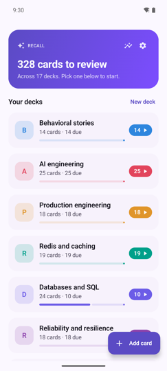
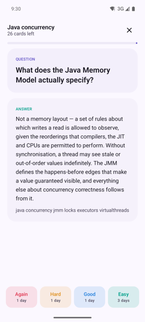
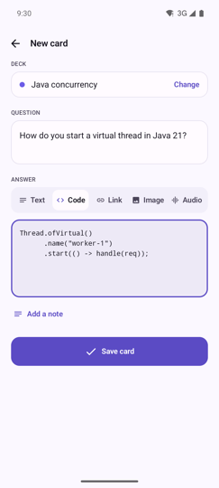
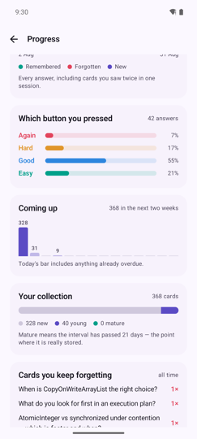

# Recall

A small, good-looking flashcard app for Android — Anki's idea (spaced repetition), with a much
simpler surface. Cards live in decks, and an answer can be **text**, **code**, a **link**, an
**image**, or **audio**.

Built with Kotlin + Jetpack Compose + Room.

| Decks | Review | Add card | Progress |
|:---:|:---:|:---:|:---:|
|  |  |  |  |
| What is due, per deck | Answer, then grade it | Five answer types | What you actually retain |

---

## Table of contents

1. [What the app does](#what-the-app-does)
2. [Running it on your phone](#running-it-on-your-phone)
3. [How an Android project maps to what you already know](#how-an-android-project-maps-to-what-you-already-know)
4. [Project layout](#project-layout)
5. [How the pieces fit together](#how-the-pieces-fit-together)
6. [The Kotlin you need to read this code](#the-kotlin-you-need-to-read-this-code)
7. [How screens move](#how-screens-move)
8. [Importing from Anki](#importing-from-anki)
9. [The scheduling algorithm](#the-scheduling-algorithm)
10. [The Progress screen](#the-progress-screen)
11. [Things you might want to change first](#things-you-might-want-to-change-first)

---

## What the app does

**Deck list (home).** A banner showing how many cards are due across all decks, then one row per
deck with its own accent colour, card count, and a progress bar. Tapping a deck always opens it for
browsing; the due badge on the right is itself a button that jumps straight into reviewing.

**Add card.** The screen the whole app is built around, kept to four things: pick a deck, type the
question, pick the answer type, fill it in. Save is disabled until the card is actually valid.

- **Text** — a normal multi-line answer. Reflows to the screen width.
- **Code** — monospace, literal whitespace, scrolls sideways instead of wrapping.
- **Link** — a URL. During review it renders as a tappable chip that opens your browser.
- **Image** — opens Android's system photo picker (no storage permission needed).
- **Audio** — opens the document picker filtered to audio. Plays inline with a scrubbing progress
  bar, and stops when you background the app.

Image and audio files are *copied* into the app's private folder, so a card keeps working even if
you later delete the original from your gallery.

**Edit card.** The pencil on any card in the deck browser reopens the same form, pre-filled. You can
change the question, the answer, the answer type, or move the card to another deck. Scheduling state
is deliberately preserved — fixing a typo should not throw away the review history that earned the
card its current interval. Replacing an image or audio file deletes the old one, but only once you
actually save.

**Import.** Bulk import from Anki — a `.colpkg`/`.apkg` package or a plain-text export; see
[Importing from Anki](#importing-from-anki).

### Why Code is its own type, and not just Text

Prose is rendered in a proportional font and reflowed to fit the screen. Both of those quietly
destroy code: proportional glyphs break column alignment, and reflowing discards the indentation
that carries the structure. A snippet pasted into a Text answer comes out unreadable — and an answer
you cannot read is a card that cannot teach you anything.

This is not a preference; it is what every tool that displays code does. Anki stores fields as HTML
and its users wrap snippets in `<pre><code>` with a syntax-highlighting add-on — even there, code is
a distinct rendering mode, just reached through a more awkward door. Recall makes it a first-class
answer type instead.

Deliberately *not* included: syntax highlighting. It needs a lexer per language and a theme that
works in light and dark, and it buys much less than monospace-plus-indentation does. Add it when you
actually miss it.

An optional **note** field is tucked behind a "Add a note" tap so the default form stays short.

**Deck detail.** Every card in the deck, each tagged with its answer type and when it's next due.
Tap a card to expand it and see the answer. Delete cards or the whole deck from here.

**Review.** Question first, tap to flip, then grade yourself with four buttons — **Again / Hard /
Good / Easy** — each labelled with when you'd next see the card. That grade feeds the scheduler.
Cards you mark "Again" come back later in the same session.

**Progress.** The chart icon on the home banner. How much you actually remember, over the last
week, month or three months: a retention figure split into young and mature cards, a bar per day of
what you studied, which of the four buttons you have been pressing, what the scheduler has queued up
for the next fortnight, how much of the collection is new against learned, retention per deck, and
the handful of cards you keep forgetting. See [The Progress screen](#the-progress-screen).

**Settings.** One setting: a daily reminder. Pick a time, and once a day the app checks whether
anything is actually due and notifies you only if it is — a reminder that fires when there is nothing
to do is a reminder you learn to swipe away.

The app is offline-only. Nothing leaves the phone, there are no accounts, and no analytics. The only
permission it declares is notifications, and only for the reminder; the photo and audio pickers
grant access to the single file you choose without any storage permission at all.

---

## Running it on your phone

You need **Android Studio** (the free official IDE — it bundles its own JDK and downloads the
Android SDK for you). Download it from <https://developer.android.com/studio>.

### 1. Open the project

Android Studio → **Open** → select this `Recall` folder → wait for "Gradle sync" to finish in the
status bar. The first sync downloads Gradle and all the libraries, so it takes a few minutes.

If it complains about a missing SDK, it will offer to install it — accept.

### 2. Put your phone in developer mode

On the phone: **Settings → About phone → tap "Build number" seven times**. Then
**Settings → System → Developer options → enable "USB debugging"**.

### 3. Plug it in and run

Connect by USB, tap **Allow** on the "Allow USB debugging?" prompt, then in Android Studio pick your
phone from the device dropdown in the toolbar and press the green **▶ Run** button. The app is
installed and launched.

### Or build an APK from the command line

```bash
./gradlew assembleDebug
```

The APK lands at `app/build/outputs/apk/debug/app-debug.apk`. Copy it to the phone and tap it (you'll
have to allow "install from unknown sources" for whichever app you opened it with).

**On this machine that already works.** The Android SDK is installed at `~/Library/Android/sdk`,
and `local.properties` at the project root already points Gradle at it. The only thing the shell
needs is a JDK on `JAVA_HOME`:

```bash
JAVA_HOME=/opt/homebrew/opt/openjdk@21 ./gradlew assembleDebug
```

> On a fresh machine you'd need `JAVA_HOME` pointing at a JDK 17 or newer and either `ANDROID_HOME`
> pointing at the SDK, or a `local.properties` file containing `sdk.dir=/path/to/Android/sdk`.
> `local.properties` is machine-specific and deliberately gitignored — never commit it. Running from
> inside Android Studio needs none of this.

### Release build — noticeably smoother

```bash
JAVA_HOME=/opt/homebrew/opt/openjdk@21 ./gradlew assembleRelease
```

Output: `app/build/outputs/apk/release/app-release.apk`, about **4.2 MB** against the debug build's
20 MB. Roughly 2.5 MB of the release APK is zstd-jni's prebuilt native library, shipped once per ABI
so a `.colpkg` can be read on any phone; the app's own code and resources are the remaining 1.7 MB.
Splitting per ABI would cut what a phone downloads, but only matters if you ever publish.

It is worth installing this one to judge how the app really feels. A debug build is not just bigger,
it is measurably less smooth, for a reason that is easy to miss: **Compose ships baseline profiles
that only apply to release builds.** In debug, that framework code is interpreted rather than
AOT-compiled, which shows up exactly as janky first-run animations. R8 shrinking and optimisation
sit on top of that.

The release build here is signed with the **debug key** purely so it can be installed side by side
for testing. It is *not* distributable: it cannot go to the Play Store, and anyone's debug keystore
could sign an update over it. Publishing would need a real upload key, which is a separate step.

### Install straight to the phone over USB

With the phone plugged in and USB debugging on:

```bash
~/Library/Android/sdk/platform-tools/adb install -r app/build/outputs/apk/debug/app-debug.apk
```

---

## How an Android project maps to what you already know

| Java/backend world | Here |
|---|---|
| Maven `pom.xml` | `build.gradle.kts` (one at the root, one per module in `app/`) |
| Multi-module parent POM | root `build.gradle.kts` + `settings.gradle.kts` |
| `mvn package` | `./gradlew assembleDebug` |
| `src/main/java` | `app/src/main/java` (Kotlin lives here too) |
| `src/main/resources` | `app/src/main/res` (but compiled and type-checked, not just copied) |
| `web.xml` / deployment descriptor | `AndroidManifest.xml` |
| JPA entity / Hibernate | Room `@Entity` + `@Dao` (`data/` package) |
| Repository / service layer | `RecallRepository` |
| Controller / presenter | `RecallViewModel` |
| JSP / Swing / template | Compose `@Composable` functions (`ui/screens`) |
| Lombok / MapStruct annotation processing | KSP (`ksp(...)` in `app/build.gradle.kts`) |

Two things have no clean Java analogue and are worth knowing up front:

**`res/` is code.** Files under `app/src/main/res` are compiled into a generated `R` class, so
`@string/app_name` in XML and `R.string.app_name` in Kotlin are checked at build time.

**One Activity, many screens.** An `Activity` is roughly "a window". This app has exactly one
([`MainActivity.kt`](app/src/main/java/com/recall/app/MainActivity.kt)); everything else is Compose
functions that a `NavHost` swaps in and out, like a card layout.

---

## Project layout

```
Recall/
├── build.gradle.kts            # plugin versions for the whole build
├── settings.gradle.kts         # which modules exist, where to fetch libraries
├── gradle/wrapper/             # pins the Gradle version; ./gradlew uses this
└── app/
    ├── build.gradle.kts        # SDK levels, compile options, dependencies
    └── src/main/
        ├── AndroidManifest.xml # app name, icon, launcher activity
        ├── res/                # strings, colours, launcher icon
        └── java/com/recall/app/
            ├── MainActivity.kt         # entry point + navigation graph
            ├── RecallApp.kt            # Application subclass (a place for setup)
            ├── data/                   # storage layer
            │   ├── Card.kt             # @Entity — one flashcard
            │   ├── Deck.kt             # @Entity — a named group of cards
            │   ├── ReviewLog.kt        # @Entity — one graded answer, the history
            │   ├── AnswerType.kt       # TEXT / LINK / IMAGE
            │   ├── Converters.kt       # teaches Room to store the enum
            │   ├── DeckWithCounts.kt   # deck + card counts, for the home screen
            │   ├── AnkiImport.kt       # parses Anki's plain-text export
            │   ├── AnkiPackage.kt      # reads .colpkg/.apkg: zip -> zstd -> SQLite
            │   ├── Migrations.kt       # how to change the schema without data loss
            │   ├── RecallDao.kt        # the SQL
            │   ├── RecallDatabase.kt   # Room database singleton
            │   ├── MediaStore.kt       # copies picked images/audio into private storage
            │   ├── ReminderPrefs.kt    # the three reminder settings
            │   └── RecallRepository.kt # the only thing the UI talks to
            ├── reminder/                # the daily notification
            │   ├── ReminderScheduler.kt # works out when it next fires
            │   ├── ReminderWorker.kt    # runs in the background, posts the notification
            │   └── Notifications.kt     # the notification channel
            ├── srs/                    # spaced-repetition scheduling
            │   ├── Sm2.kt              # the SM-2 algorithm + Rating enum
            │   ├── Stats.kt            # review history -> the Progress numbers
            │   └── DueFormat.kt        # "in 3 days", "due now"
            └── ui/
                ├── RecallViewModel.kt  # app state, survives rotation
                ├── theme/              # colours, typography, light/dark schemes
                ├── components/
                │   ├── AnswerView.kt   # renders each of the five answer types
                │   └── AudioPlayer.kt  # MediaPlayer wrapped for Compose
                └── screens/
                    ├── DeckListScreen.kt
                    ├── DeckDetailScreen.kt
                    ├── AddCardScreen.kt     # doubles as the edit screen
                    ├── ImportScreen.kt
                    ├── ReviewScreen.kt
                    ├── StatsScreen.kt
                    └── SettingsScreen.kt
```

---

## How the pieces fit together

```
Compose screens  ──user taps──▶  RecallViewModel  ──▶  RecallRepository  ──▶  Room DAO  ──▶  SQLite
      ▲                                                                                        │
      └──────────────  Flow<List<Card>> re-emits automatically on any write  ◀─────────────────┘
```

The important consequence: **nothing manually refreshes the UI.** Room's `Flow` return types make
every query a live subscription. Insert a card and the deck list's counts update on their own,
because that query's result changed. There is no `notifyDataSetChanged`, no observer wiring to
forget.

Compose works the same way in miniature. A `@Composable` function is a *description* of the UI for
the current state, not a widget tree you mutate. When state it reads changes, Compose re-runs that
function and redraws what differs. So instead of `button.setEnabled(false)` you write
`enabled = canSave` and let `canSave` change.

**Where each responsibility lives:**

- **`data/`** knows how things are stored and nothing about how they look.
- **`srs/`** is pure logic — no Android imports at all, which is why it would be the easiest part to
  unit test.
- **`ui/RecallViewModel.kt`** holds state and calls the repository. It survives screen rotation,
  which is the main reason it exists.
- **`ui/screens/`** only draws and reports taps upward through callbacks (`onSave`, `onRate`). None
  of the screens touch the database, so you can read any one of them on its own.

---

## How screens move

Worth knowing because the default is wrong and the failure looks like a rendering bug.

Navigation Compose defaults to a **700ms crossfade**. Two screens sit stacked at partial opacity for
most of a second, and in the middle — when the outgoing screen has faded out but the incoming one has
not yet faded in — *neither is opaque*, so the window background shows through. That reads as a
**flash** between pages, and no amount of tuning the durations removes it, because the transparency
is the cause.

What almost every Android app actually uses is a **push transition** (Material calls the family
*Material motion*; this one is *shared axis X*): the incoming screen slides in **fully opaque** and
covers the outgoing one, which drifts a quarter of the width the other way. Nothing fades, so no
background is ever visible, and the parallax between the two layers is what reads as *gliding*. Back
runs the same motion mirrored, which is what makes "back" feel like back rather than like another
forward step.

It is set once on the `NavHost` in
[`MainActivity.kt`](app/src/main/java/com/recall/app/MainActivity.kt) and every screen inherits it.
The rule to remember: **cross-fade content, push pages.** Fading works for a card swapping inside a
screen, where the background behind it is meant to be seen. It fails for whole screens, where it
just exposes the window.

`android:enableOnBackInvokedCallback="true"` in the manifest additionally opts into **predictive
back**, the Android 14+ gesture where dragging from the edge peels the current screen away and shows
where you are going before you commit.

## The Kotlin you need to read this code

You'll recognise most of it. The handful of things that look alien:

```kotlin
val x = 1              // final variable
var y = 2              // mutable variable
val name: String       // never null — the compiler enforces it
val note: String?      // may be null; you must handle that before using it
note?.length           // null-safe call: null if note is null
```

**`data class`** — a class with `equals`/`hashCode`/`toString`/`copy` generated:

```kotlin
data class Card(val id: Long, val question: String)
val updated = card.copy(question = "new text")   // new instance, one field changed
```

**`object`** — a singleton. `object Sm2 { fun apply(...) }` is a class with only static methods.

**Trailing lambdas.** If the last argument is a function, it moves outside the parentheses. So
`Button(onClick = { ... }) { Text("Save") }` is passing two lambdas — the second is the button's
content.

**`suspend` and coroutines.** `suspend fun` can only be called from a coroutine, and may pause
without blocking a thread. `viewModelScope.launch { ... }` starts one that is automatically
cancelled when the screen goes away — a managed background task rather than a raw `Thread`. Room
requires database calls to be `suspend` precisely so they can't run on the UI thread.

**`Flow<T>`** — a stream you subscribe to. Roughly a `Publisher` from Reactive Streams.

**`by` (delegation).** `var name by remember { mutableStateOf("") }` means "store this in a
Compose state holder, but let me read and write it like a plain variable". The `remember` part means
"keep this value across redraws".

**`@Composable`** marks a function that draws UI. It can only be called from another `@Composable`.

---

## Importing from Anki

**Settings → Import cards.** Open an Anki package (`.colpkg` or `.apkg`), open a `.txt`/`.csv`
file, or paste an export straight in. Everything re-parses as you type, so the preview is always
the truth about what the button will create.

In Anki, either export works:

- **File → Export → Anki Collection Package (.colpkg)** — or a single deck as `.apkg`. Nothing to
  configure; this is the file Anki gives you by default.
- **File → Export → Notes in Plain Text (.txt)** — the older, simpler path.

A picked file is identified by its first four bytes, not by its name or MIME type: file browsers
disagree about what a `.colpkg` is (`application/zip`, `application/octet-stream`, sometimes
nothing at all), so the picker filters on nothing and the app decides from the content.

### Packages

[`data/AnkiPackage.kt`](app/src/main/java/com/recall/app/data/AnkiPackage.kt). A package is not
text at all — it is a ZIP holding Anki's SQLite collection plus every media file:

```
export.colpkg
├── meta                    format version
├── collection.anki21b      SQLite, zstd-compressed — Anki 2.1.50 and later
│     or collection.anki21  SQLite, plain — older 2.1.x
│     or collection.anki2   SQLite, plain — legacy exports
├── media                   an index of the files below
└── 0, 1, 2, …              the media files themselves
```

So reading one means unzipping, zstd-decompressing, and querying a database — which is why
[`zstd-jni`](https://github.com/luben/zstd-jni) is a dependency and why this is the one part of the
app with tests that need a device. Both collection schemas are handled: the old one keeps deck
names as JSON in the single `col` row, the new one has a real `decks` table.

| Case | Behaviour |
|---|---|
| Note fields | field 1 is the question, the first non-empty field after it is the answer |
| Cloze notes | `{{c1::France}}` becomes a `[...]` blank in the question, `France` as the answer |
| Deck names | the deck most of the notes came from pre-fills the destination |
| Several decks | imported into one deck, with a warning saying how many were collapsed |
| Media | not imported; `` and `[sound:]` are dropped and the affected notes counted |
| Filtered decks | a card's `odid` wins over `did`, so it is filed where it really lives |
| A huge single note | skipped and counted — it will not fit in a SQLite cursor window |

The ZIP is streamed rather than copied, and reading stops at the collection entry, so a 2 GB
export with a gigabyte of media does not get unpacked to read a few thousand notes.

### Text exports

The format is one note per line, fields separated by tabs, with optional headers:

```
#separator:tab
#html:true
#deck:Spanish
#tags:vocab
What is "hello"?<tab>Hola
```

What the text parser ([`data/AnkiImport.kt`](app/src/main/java/com/recall/app/data/AnkiImport.kt))
handles, all of which turn up in real exports:

| Case | Behaviour |
|---|---|
| `#separator:` | tab, comma, semicolon, space, pipe, colon, or a literal character |
| No `#separator:` | guessed — a tab anywhere decides it, otherwise most-frequent delimiter |
| `#deck:` | pre-fills the destination deck name |
| `#tags:` | kept in the card's note field rather than discarded |
| Quoted fields | `"..."` may contain the separator, newlines, and `""` for a literal quote |
| HTML fields | `<br>` becomes a newline, tags stripped, entities decoded |
| `<pre>` / `<code>` | becomes a **Code** card |
| A bare URL answer | becomes a **Link** card |
| Extra columns | anything past the first two fields is ignored |
| A malformed line | skipped and counted, never fatal to the rest of the file |

One deliberate limitation, shared by both paths: **media is not imported**. Anki's `` tags
become plain text, because this app keys its own images by path and copying a collection's media
in is a separate job.

One gotcha worth knowing, because it is the kind of bug that looks like corruption: HTML entities
all end in a semicolon, so `&amp;` `&lt;` `&#39;` make a tab-separated file *look* semicolon-separated
to a naive delimiter guess, and every field gets cut at the first entity. The guesser strips entities
before counting, and a tab always wins outright. There is a regression test for exactly this.

## The scheduling algorithm

[`srs/Sm2.kt`](app/src/main/java/com/recall/app/srs/Sm2.kt) — about twenty real lines. Each card
carries:

- **`intervalDays`** — how long until you see it next
- **`easeFactor`** — how easy this card has been for you (starts at 2.5, floors at 1.3)
- **`repetition`** — how many times in a row you've recalled it
- **`dueAt`** — a timestamp; `dueAt <= now` means the card is in the review queue

Grade a card and:

- **Again** → interval resets to 1 day, ease drops by 0.20, lapse counted.
- **Hard / Good / Easy** → first success is 1 day (3 for Easy), second is 4 days (6 for Easy), and
  after that `interval × easeFactor`. Ease itself nudges up for Easy and down for Hard.

So a card you keep getting right goes 1 → 4 → 10 → 25 → 60 days, while one you keep failing stays in
your face. That growth curve is the whole point of spaced repetition: you review right before you'd
have forgotten, which is exactly when the recall effort does the most good.

The queries that make it work are in [`RecallDao.kt`](app/src/main/java/com/recall/app/data/RecallDao.kt) —
"due" is just `WHERE dueAt <= :now`.

---

## The Progress screen

Grading a card overwrites its scheduling state — the old interval is gone the moment SM-2 runs. So
every answer also appends a row to a second table, `reviews`
([`data/ReviewLog.kt`](app/src/main/java/com/recall/app/data/ReviewLog.kt)), which is the journal
that state was computed from and the only thing the Progress screen reads.

A row records the card, the deck, the timestamp, which button you pressed, and — the important one —
**the interval the card was on before you answered**. That last field is what makes the numbers
honest, because it is what separates the three kinds of review:

| `intervalBefore` | what it was |
|---|---|
| `0` | a first look at a new card |
| `1`–`20` | a young card |
| `21`+ | a mature card, in Anki's sense |

The journal deliberately has **no foreign key** onto cards or decks. A history that rewrites itself
when you tidy up a deck is not a history: last month's retention should not change because you
deleted a card today. The ids are plain references, and the per-deck breakdown joins against `decks`
and simply drops rows whose deck has gone.

### What "retention" counts

Of the cards you had already learned, how many did you still know?

**The first answer you gave each card each day, excluding cards that were new.** Both halves matter,
and so does the order they are applied in:

- *New cards are excluded.* You cannot forget something you never knew. Counting first looks would
  drag the figure down every time you added cards, which would make adding cards look like getting
  worse at remembering them.
- *Only the first answer of the day counts.* A card you fail comes back later in the same session. If
  every answer counted, a card you got wrong could repair its own score the moment you got it right
  ten seconds later.
- *Group first, filter second.* Drop the new-card row first and the retry that follows it gets
  promoted to being that card's answer for the day — so a card you did not know scores a clean 100%.
  Grouping first means both rows belong to the same card-day, the earliest wins, and being new
  removes the pair from the sums entirely. There is a test named after exactly this.

Young and mature are reported separately, split at 21 days. Mature retention is the number worth
watching: young cards are easy to remember because you saw them the day before yesterday.

Everything else on the screen counts *every* answer, because it is measuring work done rather than
knowledge held — the per-day bars, the totals, and the four-button breakdown all include the repeats
and the new cards. The captions on the screen say so.

### The rest of the panels

| Panel | Where the number comes from |
|---|---|
| Streak | consecutive local dates with at least one review; an unfinished today does not break it |
| Reviews per day | every answer, stacked remembered / forgotten / new; a day off is a flat tick |
| Which button you pressed | the grade distribution, all answers |
| Coming up | `dueAt` on the cards table for the next 14 days; anything overdue lands on today |
| Your collection | new / young / mature, split on the card's current interval |
| By deck | retention per deck, weakest first; decks with no reviews are left out |
| Cards you keep forgetting | the `lapses` counter on the cards table, all time |

### Where the work happens

[`srs/Stats.kt`](app/src/main/java/com/recall/app/srs/Stats.kt) is pure Kotlin: it takes the rows,
the timezone and today's date as arguments and returns one immutable snapshot. Nothing in it touches
the clock or the database, which is why the counting rules above are tested on a plain JVM rather
than on a phone.

That is also why the day bucketing is done in Kotlin rather than in SQL. The day a review belongs to
is a *local* date, and SQLite has no idea which timezone you were in or whether the clocks changed;
`java.time` does. A session at 11pm belongs to the evening you were having, not to whatever date it
was in UTC — there is a test pinning that too. So the DAO hands over rows for the window and the
aggregation happens in Kotlin. Ninety days of heavy study is a few thousand small rows, which is
cheaper to pass around than a wrong answer is to explain. The one exception is the streak, which
needs all of history: SQLite thins that to one timestamp per day studied before Kotlin decides which
local dates those are.

Upgrading an existing install adds the table and starts you at empty. There is nothing to backfill
from — the old schema never recorded a history — and inventing plausible-looking past reviews would
make your first retention figure a lie.

---

## Things you might want to change first

Each of these is a small, self-contained edit — good for getting your bearings.

**Change the colours.** [`ui/theme/Color.kt`](app/src/main/java/com/recall/app/ui/theme/Color.kt).
`DeckAccents` is the list decks cycle through; add a colour and it shows up in the new-deck dialog
automatically.

**Change how aggressive the scheduling is.** The numbers in `Sm2.apply`. Making the first interval
3 days instead of 1 is a one-character change.

**Add a sixth answer type** (a formula, a video): add a value to
[`AnswerType`](app/src/main/java/com/recall/app/data/AnswerType.kt), add a branch in
[`AnswerView`](app/src/main/java/com/recall/app/ui/components/AnswerView.kt), and add an entry to
`AnswerTypeSelector` in `AddCardScreen.kt`. The enum's `when` blocks are exhaustive, so the compiler
will point you at every place that needs updating — lean on that. The selector is a `FlowRow`, so it
wraps to a second line on its own. No database migration is needed: enum values are stored as text.

**Record audio in-app** instead of only picking a file. `MediaRecorder` plus the `RECORD_AUDIO`
permission, writing into the same private folder `MediaStore` already uses.

**Export**, the mirror of import. Walk the cards and emit the same tab-separated format with a
`#separator:tab` header, so a Recall deck opens straight back up in Anki.

**Add tags** as a real concept. Imported tags currently land in the card's note field rather than
being dropped, but nothing filters on them yet. This one *does* need a migration — see below.

### Running the tests

```bash
./gradlew test
```

Plain JUnit on the JVM, no emulator. `srs/Sm2.kt`, `srs/Stats.kt` and `data/AnkiImport.kt` have no
Android dependencies, which is exactly why they are the parts worth testing this way — and why the
retention rules live in `Stats.kt` instead of in the SQL or the Compose code.

```bash
./gradlew connectedDebugAndroidTest
```

Needs a running emulator or a plugged-in phone, and covers two things. `data/AnkiPackage.kt`: zip,
zstd and SQLite are all real device machinery, so the tests build actual `.colpkg` and `.apkg`
files — in both of the layouts Anki produces — and read them back. And the migrations: `MigrationTest`
creates a real version 1 database with cards in it, runs the migration, and checks both that the
cards came through with their scheduling intact and that the resulting schema is one Room accepts.

### Changing the database

**Nothing here will wipe your cards.** The database is deliberately built *without*
`fallbackToDestructiveMigration()`. If you change an `@Entity`, bump `version`, and forget the
migration, the app crashes on launch with this:

```
java.lang.IllegalStateException: A migration from 1 to 2 was required but not found.
Please provide the necessary Migration path via RoomDatabase.Builder.addMigration(Migration ...)
```

That is the good outcome, and it is worth being clear about why. What
`fallbackToDestructiveMigration()` does instead — and what this project used to do — is silently
delete the database and rebuild it empty. No error, no prompt. You would find out when every card you
had ever written was gone. A crash you fix in five minutes is strictly better than data you cannot
get back.

The recipe, in [Migrations.kt](app/src/main/java/com/recall/app/data/Migrations.kt):

1. Change the `@Entity` — add a column, a table, an index.
2. Bump `version` in the `@Database` annotation, `1` → `2`.
3. Write a `Migration(1, 2)` and add it to `MIGRATIONS`.
4. Build once. Room writes `app/schemas/2.json` — **commit it**. Diffing it against `1.json` shows
   exactly what SQL your migration has to produce.
5. Install the new build *over* the old one (don't uninstall) and confirm your data is still there.

`app/schemas/` is the schema history, one JSON file per version, checked into git on purpose: it is
what makes step 4 possible and what Room's migration tests read. `MigrationTest` in the androidTest
source set does step 5 for you on every run: `runMigrationsAndValidate` compares the migrated
database against `2.json`, so a migration whose SQL has drifted from the entity — a missing index, a
column typed `INTEGER` where the entity says `Double` — fails there rather than on someone's phone.
Version 2 adds the review journal behind the Progress screen, and is worked through in
[Migrations.kt](app/src/main/java/com/recall/app/data/Migrations.kt).

SQLite can `ALTER TABLE ADD COLUMN`, but it cannot drop or retype a column. For those you create a
new table, copy the rows across, drop the old one and rename — there is a worked example in the
comments of that file.

Adding a *value* to an enum like `AnswerType` needs none of this. Enums are stored as text, so the
schema does not change — which is exactly why Code and Audio were added without any migration.

---

## Versions

Kotlin 2.0.20 · AGP 8.6.1 · Gradle 8.9 · Compose BOM 2024.09.03 · Room 2.6.1 · Coil 2.7.0 ·
WorkManager 2.9.1 · `minSdk 26` (Android 8.0) · `targetSdk 35`

## Verified

Built and run on an Android 15 (API 35) emulator, not just compiled. Zero warnings, zero errors.
29 JVM unit tests pass — 14 for the Anki text parser, 15 for the stats. (`./gradlew test` reports 58,
because it runs the whole suite once per build variant.) 7 on-device tests pass
(`./gradlew connectedDebugAndroidTest`): 5 for the package importer, 2 for the migration.

Exercised on-device:

- A card of each of the five answer types, added and then reviewed.
- Editing an existing card: the form pre-fills, the answer type stays selected, and saving preserves
  the card's scheduling state.
- Import: separator auto-detected, a URL answer correctly classified as a Link, the new deck created,
  and the rows confirmed in SQLite afterwards.
- The review counter across a full session including an "Again" rating.
- Notifications: permission prompt, and a test notification confirmed posted via `dumpsys`.
- The launcher icon inspected at 4x from the recents switcher.
- The review journal: a session graded through the UI — including an "Again" and its repeat — then
  the rows read back out of SQLite to confirm each one recorded the interval the card was actually
  answered on.
- The Progress screen against a month of history, in light and dark, at all three windows.

Running it on a real phone and on the emulator has now caught eight bugs that compiling did not:

1. **Due counts stuck at zero.** `strftime('%s','now')` has whole-second precision, so a card saved
   milliseconds earlier read as not-yet-due — and because a Room `Flow` only re-emits when the
   *table* changes, that wrong zero never corrected itself. Fixed with a millisecond clock
   (`julianday`) plus a ticker that re-subscribes so the count tracks the passing clock.
2. **"Again" then "Good" erased the lapse**, because the re-queued card was the stale pre-rating
   snapshot and recomputed from the original state.
3. **Rotating the phone wiped the add form** — `remember` does not survive Activity recreation;
   `rememberSaveable` does.
4. **The review counter ran away.** Rating "Again" re-queues a card, so counting raw positions gave
   "4 of 4", then "5 of 5". Now it counts distinct cards remaining, which only ever decreases.
5. **A deck with cards due could not be browsed at all.** Tapping the row went straight to review,
   which made the edit button unreachable for every active deck. The row now opens the deck and the
   badge starts the review.
6. **The launcher icon sat low.** Geometric centring is not enough for a layered stack: the opaque
   front card carries more visual weight than the translucent ones behind it, so it needed centring
   by alpha-weighted area.
7. **The delimiter guesser was fooled by HTML entities**, cutting `Q&amp;A` into `Q&amp`. Caught by
   a unit test before it ever ran on a device.
8. **A new card you failed and then passed scored 100% retention.** Only visible in real graded rows:
   excluding the new-card answer *first* left the retry standing in as that card's answer for the
   day. Grouping by card-and-day before excluding new cards drops the pair together, which is what
   the number should do.
